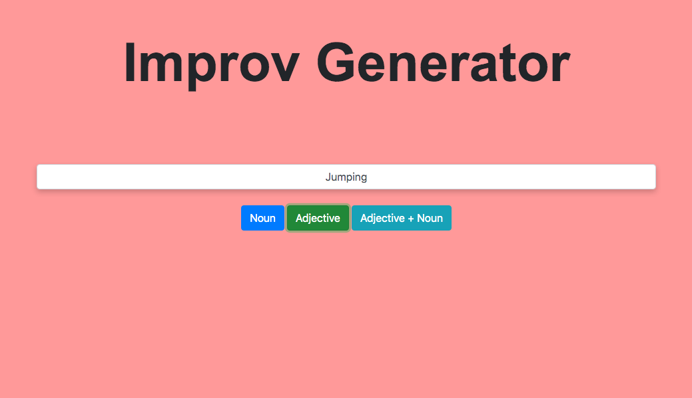

# Improv Generator

This could be used for improvisors, script writers, or even artists such as illustrators. The idea is to follow the improv technique of not planning ahead by generating objects, nouns, adjectives, etc. at random.

### Design

Static webpage with a input bar and a few buttons

- Perhaps use a dictionary API to generate words
  - My current thought is to ping a dictionary API and check its *parts of speech* with a while loop for the correct buttons
  - So far the only way I have figured out how to do this is via quering for a random word and then query that exact random word's data to get its *partOfSpeech*. This creates a bug in that if the user pushes the noun button and the API does not get a *noun* than the button appears to do nothing.

**Bonus:** Perhaps make an option to have an XXX version (Urban Dictionary API?)

### Unsure or need to change

- I'm unsure of the spacing/padding of the elements. I just used a couple <code>br</code> tags to get the desired effect but I'm not sure that is correct. Something makes me think every graphical element needs to go inside some kind of <code>div</code> named <code>row</code> or <code>col</code> that way it can take advantage of the grid system - I think..

### Tutorials:

[How to set an input text with JavaScript ](https://www.youtube.com/watch?v=AfRHl3soLDg)

